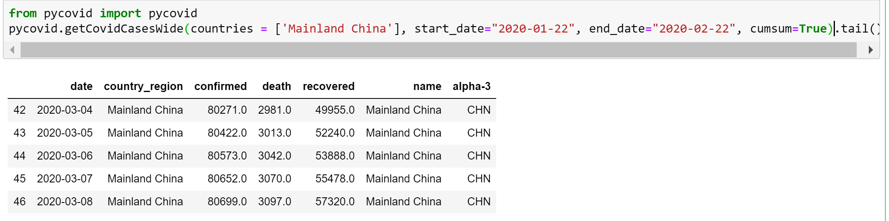
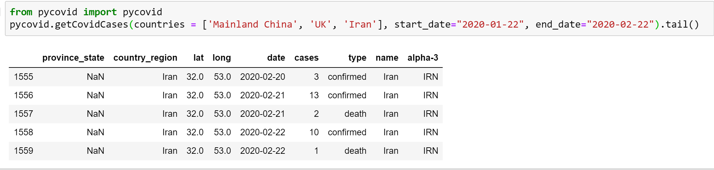
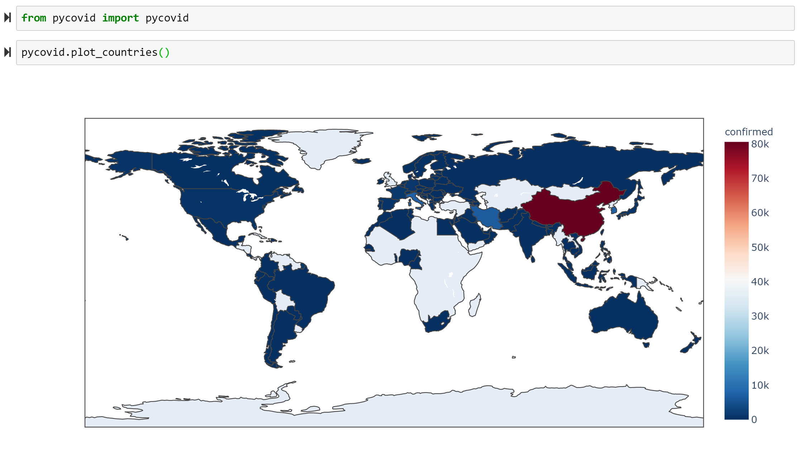
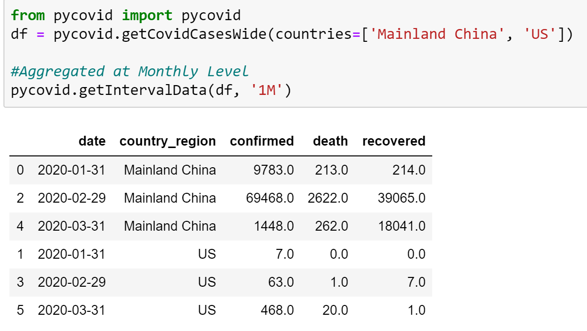

# PyCOVID Package

The PyCOVID package provides a Pandas Dataframe of the 2019 Novel Coronavirus COVID-19 (2019-nCoV) epidemic based on Rami Krispin's 'coronavirus' package in R. The raw data pulled from the Johns Hopkins University Center for Systems Science and Engineering (JHU CCSE) Coronavirus

</a>

### Quick Installation

```py
pip install pycovid
```
### Importing

```py
from pycovid import pycovid
pycovid.getCovidCases()
```

## Value Addition

The 'coronavirus' R package gets access to data, but the 'pyCOVID' package builts some additional functionality over it.

1. Wide Format for quicker analysis (Wide by case type - Confirmed/Death/Recovered)
2. Filtering options - By country, timeline, casetype
3. Cumulative Aggregating options - cumsum parameter to look at the cumulative totals of how the Coronavirus has grown over time
4. Time Resampling: Converts dataframe to time-indexed, and resamples at required time level (weekly, monthly, etc)
5. Quick visualization using Plotly: Use the plotCountries() function


Usage
-----

**getCovidCasesWide()** : Get the wide version of the Coronavirus Dataset
Parameters: 
1. Countries: List of Countries (Default: All Countries)
2. start_date and end_date: Use these to set the time window you wish to access
3. casetype: Python List of Case Types ('confirmed', 'death' and 'recovered' and Default is all) 
4. cumsum: Gets cumulative sums of cases for each country in list (Default: False)

</a>

**getCovidCases()** : Get the Rami Krispin Coronavirus Dataset in the original format
Parameters: 
1. Countries: List of Countries (Default: All Countries)
2. Provinces: List of Provinces and States (Default: All)
3. start_date and end_date: Use these to set the time window you wish to access
4. casetype: Python List of Case Types ('confirmed', 'death' and 'recovered' and Default is all) 

</a>

**plotCountries()**: Plot the country aggregates on world map using Plotly
Parameters:
1. df: Pass a wide dataframe to the function with country-wise aggregates on confirmed, death and recovered cases
2. grouped_date: Boolean to indicate whether dataset has been aggregated at country level or not
3. metric: Can be 'confirmed' or 'death' or 'recovered'

</a>

**plotProvinces()**: Plot the values from provinces within a country over time
1. countries - just include one
2. provinces - include names of any states or provinces
3. start_date and end_date: as above
4. casetype: as above

```py
from pycovid import pycovid

pycovid.plot_provinces(contries=['Canada'], 
						provinces=['Alberta', 'Ontario', 'Quebec', 
								'Manitoba', 'British Columbia', 
								'New Brunswick', 'Saskatchewan'], 
						casetype=['confirmed'], start_date="2020-02-20")
```

</a>

**getIntervalData()**: Get resampled dataset of the Coronavirus based on the date (by default Monthly level)
1. df: Pass a wide dataframe to the function
2. interval: The time interval you wish to resample the dataset to: 1D = Daily, 1W: Weekly, 1M: Monthly

</a>

Installation
------------
```py
pip install pycovid
```
```py
from pycovid import pycovid
pycovid.getCovidCases()
```
or with virtual environment

```bash
# Configure a virtual environment in project directory
python3 -m venv venv 
# Activate the environment (assign paths)
source venv/bin/activate 
# Upgrade Pip and install requirements
pip install --upgrade pip 
pip install pycovid
```

Requirements
------------
Pandas, Numpy and Plotly

Authors
-------
PyCOVID was written by Sudharshan Ashok <sudharshan93@gmail.com>

Licence
-------
MIT License


